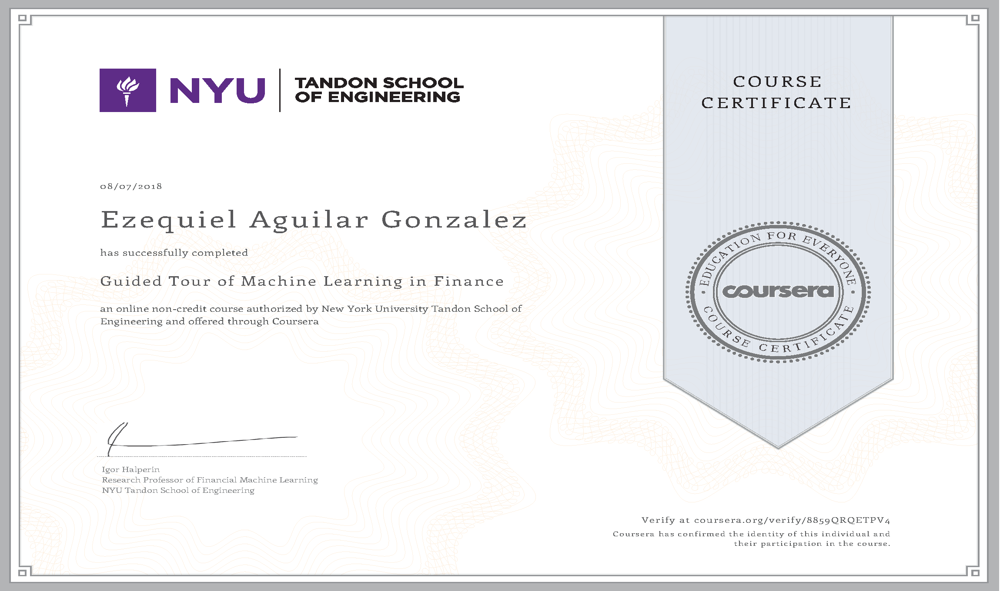

# Course 01 - Guided Tour of Machine Learning in Finance

This course aims at providing an introductory and broad overview of the field of ML with the focus on applications on Finance. Supervised Machine Learning methods are used in the capstone project to predict bank closures. Simultaneously, while this course can be taken as a separate course, it serves as a preview of topics that are covered in more details in subsequent modules of the specialization Machine Learning and Reinforcement Learning in Finance. The goal of Guided Tour of Machine Learning in Finance is to get a sense of what Machine Learning is, what it is for and in how many different financial problems it can be applied to.

Table of contents
=================

<!--ts-->
   * [Certificate](#certificate)
   * [Programming Assignment](#programming-assignment)

<!--te-->

Certificate
==============

Programming Assignment
=====================
1. Euclidean Distance Calculation: Euclidean Distance Calculation. In this assignment you will compute Euclidean distance between elements in n-dimensional space. Each coordinate of a point in n-dimensional space is sampled from Uniform distribution. We will study properties of distribution of Euclidean distances by varying dimensionality of the space.
2. 
